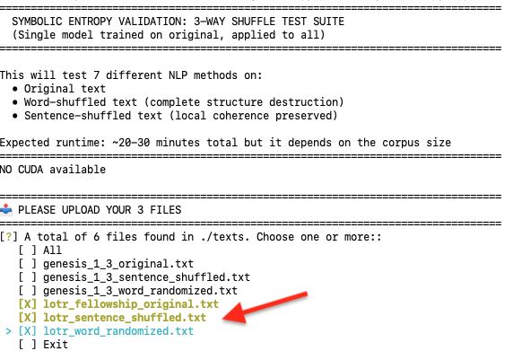

# Symbolic Category Entropy (ScE)
Symbolic Category Entropy (ScE) combines Shannon entropy (H) with Symbolic Surplus (SΣ),  motif-concentration metric computed via Kullback–Leibler (KL) divergence.

Existing Natural Language Processing (NLP) methods described as semantic fail to detect the destruction of meaning when text is shuffled, exposing a discriminant validity gap in computational semantics. We introduce Symbolic Entropy (ScE), a two-component information-theoretic methodology combining Shannon entropy (H) with Symbolic Surplus (SΣ), a motif- concentration metric computed via Kullback–Leibler (KL) divergence. SE tracks order-sensitive narrative semantic structure as theorized by Lubomır Dolezel. We apply a shuffle test to seven widely-used NLP methods and to SE on two corpora: Genesis 1–3 (KJV) and Tolkien’s The Fellowship of the Ring.

No tested method produces a single metric display that detects both word-order and sentence-order disruption simultaneously. SE consistently produces distinguishable heatmap outputs across original, word-shuffled, and sentence-shuffled conditions in both corpora, demonstrating order-sensitive semantic measurement where many existing methods fail. The SE method here proposed can be used for semantic-based retrieval tasks as well for indexing and classification of documents.

# Contents of this repo

```
├── src/
│   ├── nlp_shuffle_tester.py              # Computes up to 7 NLP methods and generate stats/results
│   ├── se_master_calculator.py            # Computes Symbolic Category Entropy on a given set of texts
│   ├── genesis1-3_motifs.py               # 19-category motif dict, Genesis 1-3
│   └── lotr_motifs.py                     # 15-category motif dict, Fellowship of the Ring
│
├── texts/
│   ├── genesis_1_3_original.txt           # Genesis 1-3 original text
│   ├── genesis_1_3_word_randomized.txt    # Genesis 1-3 word shuffled text
│   ├── genesis_1_3_sentence_shuffled.txt  # Genesis 1-3 sentence shuffled text
│   ├── lotr_fellowship_original.txt       # Lord of the Rings original text
│   ├── lotr_word_randomized.txt           # Lord of the Rings word shuffled text
│   └── lotr_sentence_shuffled.txt         # Lord of the Rings sentence shuffled text
│
├── output/
│   └── README.md                          # Description of the output directory where results are stored
│
└── README.md                              # Main README file

```
# Requirements: 

1. Core SE Calculator dependencies:
numpy
pandas
matplotlib
scipy
python-docx
 
2. 7-Method Shuffle Tester dependencies:
scikit-learn
gensim
bertopic
umap-learn
hdbscan
transformers
torch
bert-score
spacy

3. General Requirements: 
spaCy language model (install separately after pip install):
python -m spacy download en_core_web_sm
 
---

## Quick Start

### 1. Install dependencies

The best approach is to create a python virtual enviornment, then install dependencies

If running on Mac OSX use this install
```bash
pip install -r requirements.txt
```

If running on Ubuntu use this install
```bash
pip install -r requirements_ubuntu.txt
```

### 2. Run SE analysis (Genesis)

```bash
python ./se_master_calculator.py \
  genesis_1_3_original.txt \
  genesis_1_3_word_randomized.txt \
  genesis_1_3_sentence_shuffled.txt
```

To generate the shuffled variants from the original:

```python
import random, re

with open("texts/genesis_original.txt", "r") as f:
    text = f.read()

# Word shuffle
words = text.split()
random.seed(42)
random.shuffle(words)
with open("texts/genesis_1_3_word_randomized.txt", "w") as f:
    f.write(" ".join(words))

# Sentence shuffle (paragraph-level)
paragraphs = [p.strip() for p in text.split("\n\n") if p.strip()]
random.seed(42)
random.shuffle(paragraphs)
with open("texts/genesis_1_3_sentence_shuffled.txt", "w") as f:
    f.write("\n\n".join(paragraphs))
```

### 3. Run SE analysis (This example is for LOTR "Lord of the Rings")

```bash
python ./se_master_calculator.py \
  lotr_fellowship_original.txt \
  lotr_word_randomized.txt \
  lotr_sentence_shuffled.txt
```

### 4. Run 7-method comparison

```bash
python ./src/nlp_shuffle_tester.py 
```

### You will be prompted to select specific files

The 3 versions for a given text have to be selected for the analysis to work. Use the right and left arrows to select the texts, then press Enter to start the analysis. The example below shows how to select the 3 required texts to analyze the Lord of the Rings.


---

## Motif Dictionaries

Motif dictionaries are stored as Python dicts in `src/` and imported directly by the calculator. Each category groups semantically related words and multi-word phrases that index the same underlying narrative motif.

**Genesis** (`genesis_motifs.py`): 19 categories, 253 words, 93 phrases  
**Fellowship of the Ring** (`lotr_motifs.py`): 15 categories

To use a different motif dictionary, import it in the calculator's configuration block:

```python
from motifs.genesis_motifs import motif_dict   # Genesis
from motifs.lotr_motifs import motif_dict      # LOTR
```

---

## Parameters Used in this experiment

| Parameter | Value |
|-----------|-------|
| Window size | Adaptive (~500 tokens for Genesis, ~1550 for LOTR) |
| Overlap | 50% |
| Target windows | 120 |
| Random seed | 42 |
| Sentence shuffling | Paragraph-level (`\n\n` splitting) |

---

## Expected Outputs

Running the calculator produces the following files (named by input text):

| File | Description |
|------|-------------|
| `<name>_se_heatmap.png` | KL divergence heatmap with H and Σ overlays |
| `<name>_3way_comparison.png` | Side-by-side trifold: original / word-shuffled / sentence-shuffled |
| `<name>_se_timeseries.png` | H and Σ line plots across windows |
| `<name>_peaks_valleys.png` | Top peaks and valleys with text excerpts |
| `<name>_se_results.csv` | Full numerical results per window |
| `<name>_validation_summary.csv` | Cohen's *d* statistics for shuffle comparison |

---


## Repository Links

- SE Calculator: [https://github.com/computingcelts/symb-entropy/blob/main/src/se_master_calculator.py](https://github.com/computingcelts/symb-entropy/blob/main/src/se_master_calculator.py)
- NLP Method Shuffle Tester: [https://github.com/computingcelts/symb-entropy/blob/main/src/nlp_shuffle_tester.py](https://github.com/computingcelts/symb-entropy/blob/main/src/nlp_shuffle_tester.py)

---

## Citation

```bibtex
@inproceedings{monroy2025symbolic,
  title={Symbolic Category Entropy: A New Entropy Metric
for Order-Sensitive Narrative Semantics},
  author={Monroy, Carlos and Kurian, Michael Joseph},
  year={2025}
}
```

---

## License

Code: MIT License  
Genesis 1–3 (KJV): Public domain  
LOTR corpus: Not included — see [output/README.md](https://github.com/computingcelts/symb-entropy/blob/main/output/README.md)
